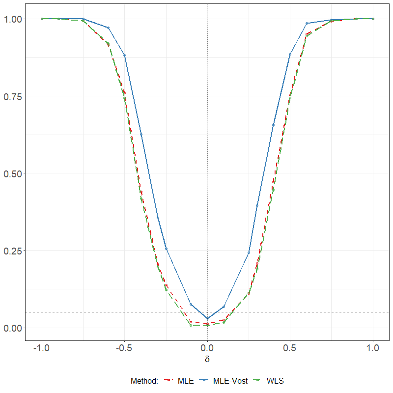
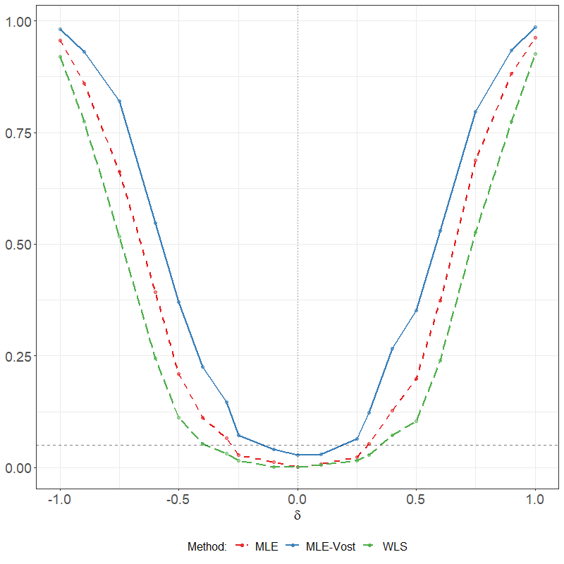
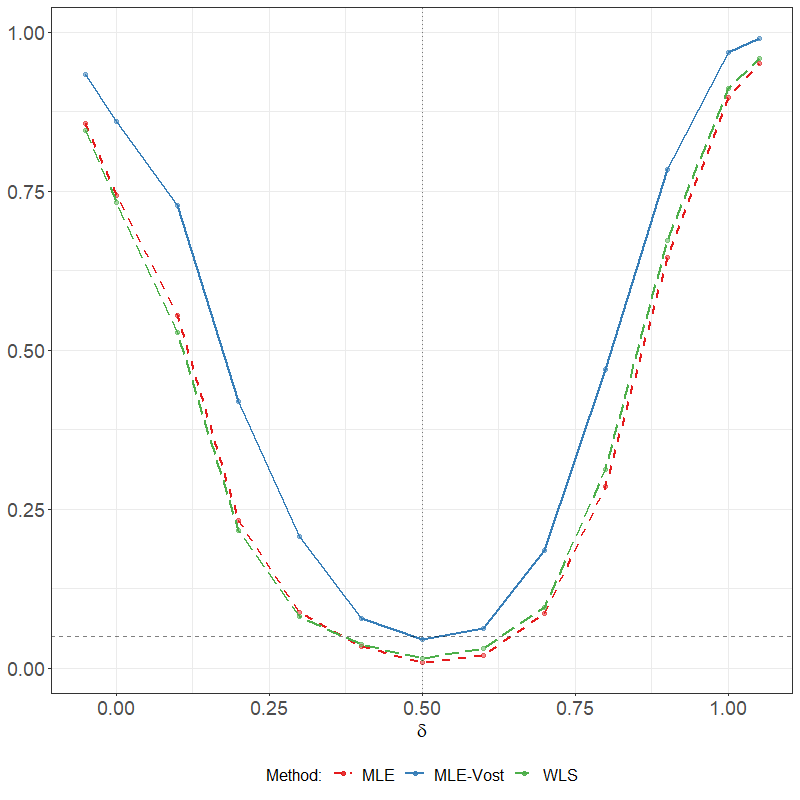
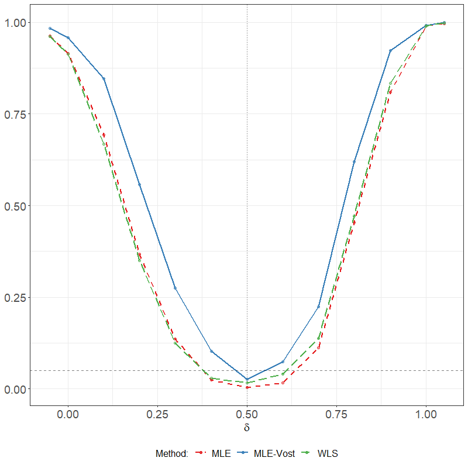
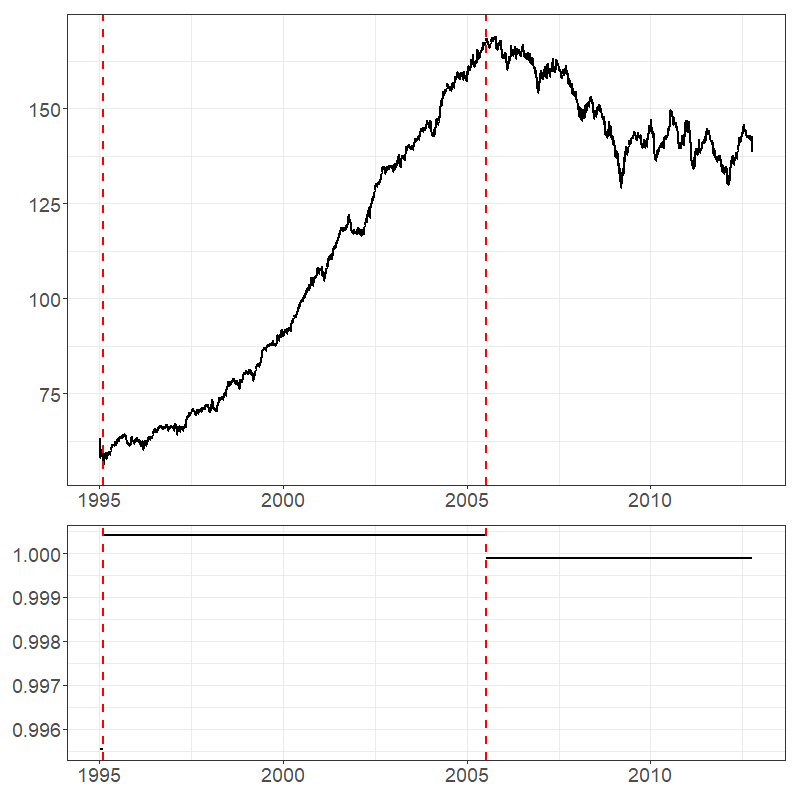
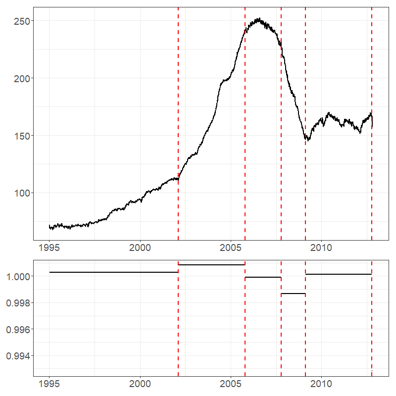
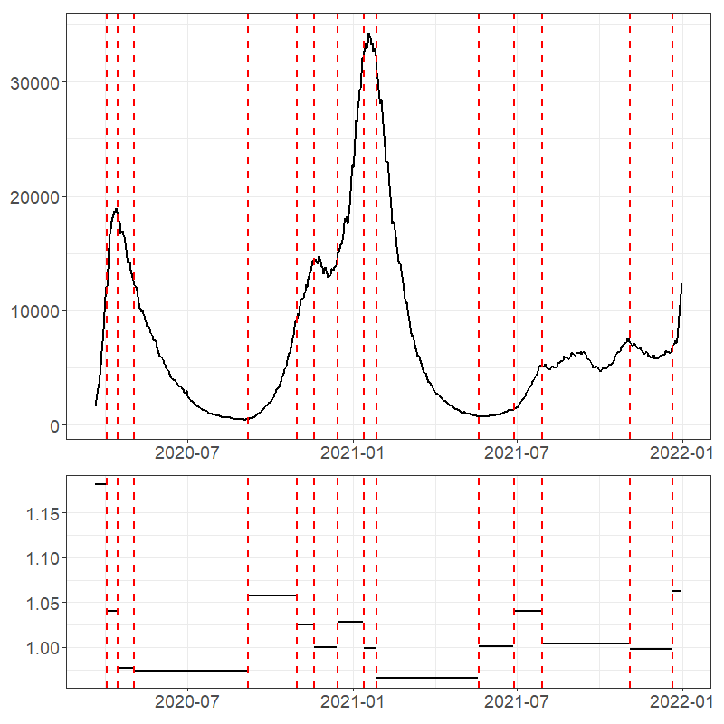
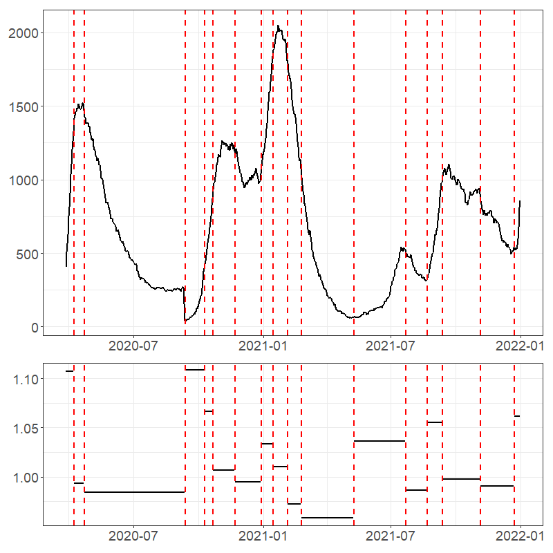
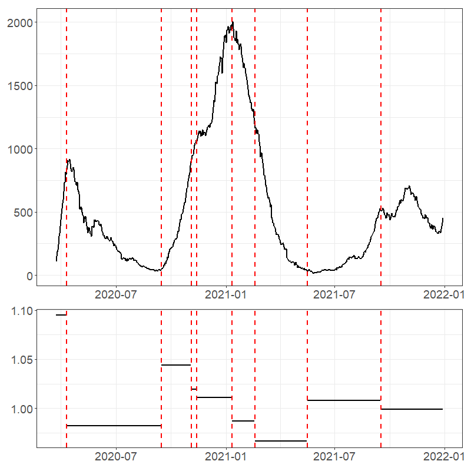

```{r, include = FALSE}
knitr::opts_chunk$set(
  collapse = TRUE,
  comment = "#>"
)
```


This vignette is a companion to the paper `The maximally selected likelihood 
ratio test in random coefficient models.' The code to build all figures in that
paper are presented. Discussions on these figures are conducted in the paper and
are not addressed in this data supplement.
```{r setup}
library(RCAmle)
`%>%` <- magrittr::`%>%`
```

Completing all trials is a computational burden. Consequently, the following 
variable is set to 'TRUE', showing the code but through loading results. Change to 
'FALSE' to run all simulations.
```{r setMethod}
quicklyRun <- TRUE
```

The stationary region (Figure 3.1) was built using the following code.
```{r, stationaryRegion, eval=!quicklyRun}
set.seed(12345)
data_sr <- simulateStationaryRegion(nSims = 10000000, silent=T)
```

The results of that code includes the following figure.
```{r, loadStationaryRegion, echo=F, eval=quicklyRun}
data_sr <- readRDS("data_sr.rds")
```

```{r, plotStationaryRegion, fig.cap = "(Figure 3.1) Simulation stationary region using Gaussian error based on $E\\log |\\beta + \\epsilon_{0,1} |$",fig.width = 5.5}
data_sr[[3]]
```

The empirical rejection frequencies under the null case (Table 3.1) was generated using the following code.
```{r, empiricalRejection, eval=!quicklyRun}
data_er <- simulationTable_NC(betas = c(0.5,0.75,1,1.05), 
                              varProbRates = c(0.5, 0.5),
                              nSims=500, iterations = c(100, 200, 400, 800), 
                              burnin = 1000, lowerEst=c(-Inf,0,10^-8,-Inf), 
                              upperEst=c(Inf,Inf,Inf,Inf), alpha = 0.05,
                              errorTypes = c('Normal','Bernoulli','Exponential'),
                              CPLoc=0.5, seed=1234,trimAmt=10)
```

The results of that code is the following data.
```{r, loadEmpiricalRejection, echo=quicklyRun}
data_er <- readRDS("data_er.rds")
```

```{r, tableStationaryRegion, fig.cap='(Table 3.1) Empirical rejection frequencies under the null.'}
data_er$errType <- ifelse(data_er$errType=='Normal','N',
                          ifelse(data_er$errType=='Bernoulli','B','E'))
tmp <- data_er %>%
  dplyr::select(-c(Lower,Upper)) %>%
  tidyr::pivot_wider(names_from = c(iters,errType), values_from = Estim)

kableExtra::kable(tmp[,!(colnames(tmp)%in%c('beta'))], booktabs = TRUE) %>%
  kableExtra::pack_rows(index = table(tmp$beta))
```

The power curves (Figure 3.2) were built using the following code.
```{r, powerCurves, eval=!quicklyRun}
tmp <- c(1, 0.9,0.75, seq(0.6,0.3,-0.1),0.25,0.1)
U4seq <- c(tmp, 0, rev(-tmp))
set.seed(1234)
pc1 <- simulatePowerCurve(Us3 = c(0, 0.5, 0.5), U4s = U4seq,
                     nSims = 500, lowerEst = c(-Inf,0,10^-8,-Inf), 
                     upperEst = rep(Inf,4), alpha = 0.05,
                     burnin = 1000, k = 0.5 * 400, N = 400, 
                     errorType = 'Normal', trimAmt=10,
                     silent=T)

set.seed(1234)
pc2 <- simulatePowerCurve(Us3 = c(0, 0.5, 0.5), U4s = U4seq,
                     nSims = 500, lowerEst = c(-Inf,0,10^-8,-Inf), 
                     upperEst = rep(Inf,4), alpha = 0.05,
                     burnin = 1000, k = 0.9 * 400, N = 400, 
                     errorType = 'Normal', trimAmt=10,
                     silent=T)

U4seq <- c(1.05,seq(1,0.6,-0.1), 0.5, seq(0.4,0,-0.1),-0.05)
set.seed(1234)
pc3 <- simulatePowerCurve(Us3 = c(0.5, 0.5, 0.5), U4s = U4seq,
                     nSims = 500, lowerEst = c(-Inf,0,10^-8,-Inf), 
                     upperEst = rep(Inf,4), alpha = 0.05,
                     burnin = 1000, k = 0.5 * 400, N = 400, 
                     errorType = 'Normal', trimAmt=10,
                     silent=T)

set.seed(1234)
pc4 <- simulatePowerCurve(Us3 = c(0.5, 0.5, 0.5), U4s = U4seq,
                     nSims = 500, lowerEst = c(-Inf,0,10^-8,-Inf), 
                     upperEst = rep(Inf,4), alpha = 0.05,
                     burnin = 1000, k = 0.5 * 400, N = 400,
                     errorType = 'Bernoulli', trimAmt=10,
                     silent=T)
```

The resulting power figures are as follows (See the paper for details on each of the figures).

```{r, plotPowerCurves1, fig.cap = '(Figure 3.2, upper left) Power curves as a function of the change in RCA coefficient.',fig.width = 5.5, eval=quicklyRun, echo=quicklyRun}
# Saved for speed
 #pc1[[1]]
```
```{r, plotPowerCurves1.1, fig.cap = '(Figure 3.2, upper left) Power curves as a function of the change in RCA coefficient.',fig.width = 5.5, eval=!quicklyRun, echo=!quicklyRun}
pc1[[1]]
```

```{r, plotPowerCurves2, fig.cap = '(Figure 3.2, upper right) Power curves as a function of the change in RCA coefficient.',fig.width = 5.5, eval=quicklyRun, echo=quicklyRun}
 #pc2[[1]]
```
```{r, plotPowerCurves2.1, fig.cap = '(Figure 3.2, upper right) Power curves as a function of the change in RCA coefficient.',fig.width = 5.5, eval=!quicklyRun, echo=!quicklyRun}
pc2[[1]]
```

```{r, plotPowerCurves3, fig.cap = '(Figure 3.2, lower left) Power curves as a function of the change in RCA coefficient.',fig.width = 5.5, eval=quicklyRun, echo=quicklyRun}
 #pc3[[1]]
```
```{r, plotPowerCurves3.1, fig.cap = '(Figure 3.2, lower left) Power curves as a function of the change in RCA coefficient.',fig.width = 5.5, eval=!quicklyRun, echo=!quicklyRun}
pc3[[1]]
```

```{r, plotPowerCurves4, fig.cap = '(Figure 3.2, lower right) Power curves as a function of the change in RCA coefficient.',fig.width = 5.5, eval=quicklyRun, echo=quicklyRun}
 #pc4[[1]]
```
```{r, plotPowerCurves4.1, fig.cap = '(Figure 3.2, lower right) Power curves as a function of the change in RCA coefficient.',fig.width = 5.5, eval=!quicklyRun, echo=!quicklyRun}
pc4[[1]]
```

The US housing figures (Figure 4.1) were built using the following code.
```{r, housingData, eval=!quicklyRun}
housingDataList <- list()
for(city in c('Boston','LosAngeles')){
  
  ## Load data
  data <- housing[housing$city==city,c(2,3)]
  data <- data[order(data$date),]
  
  ## Detect CP
  set.seed(12345)
  result_Vost <- binarySegmentationCPDetection(fullData=data, 
                                       method='Vostrikova',
                                       lower=c(-Inf, 0, 10^-8, -Inf),
                                       upper=c(Inf, Inf, Inf, Inf),
                                       alpha=0.05,
                                       trimAmt = 10, silent = T )
  
  data_plot <- renderStackedPlot(trueData = data, 
                     parCPData = result_Vost[,c(1:2,7:10)],
                     title = NULL,
                     subtitle = NULL,
                     varPlots = FALSE)
  
  ## Save data
  housingDataList <- append(housingDataList, list(list(result_Vost,data_plot)))
}
```

The results were as follows.
```{r, loadHousingData, echo=F, eval=quicklyRun}
housingDataList <- readRDS("housingDataList.rds")
```

```{r, plotHousingData_Boston, fig.cap = '(Figure 4.1, right)  Daily US housing price indices in Boston.',fig.width = 5.5, eval=quicklyRun, echo=quicklyRun}
 #housingDataList[[1]][[2]]
```
```{r, plotHousingData_Boston.1, fig.cap = '(Figure 4.1, right)Daily US housing price indices in Boston.',fig.width = 5.5, eval=!quicklyRun, echo=!quicklyRun}
housingDataList[[1]][[2]]
```

```{r, plotHousingData_LA, fig.cap = '(Figure 4.1, left) Daily US housing price indices in Los Angeles.',fig.width = 5.5, eval=quicklyRun, echo=quicklyRun}
 #housingDataList[[2]][[2]]
```
```{r, plotHousingData_LA.1, fig.cap = '(Figure 4.1, left) Daily US housing price indices in Los Angeles.',fig.width = 5.5, eval=!quicklyRun, echo=!quicklyRun}
housingDataList[[2]][[2]]
```

The UK covid-19 figures were built using the subsequent code.
```{r, UKCovidData, eval=!quicklyRun}
UKCovidList <- list()
for(nation in c('England','Northern Ireland','Scotland','Wales')){
  
  ## Load data
  data <- UKcovid[UKcovid$nation==nation,c(2,3)]
  data <- data[order(data$date),]
  
  ## Detect CP
  set.seed(12345)
  result_Vost <- binarySegmentationCPDetection(fullData=data, 
                                       method='Vostrikova',
                                       lower=c(-Inf, 0, 10^-8, -Inf),
                                       upper=c(Inf, Inf, Inf, Inf),
                                       alpha=0.05,
                                       trimAmt = 10, silent = T )
  data_plot <- renderStackedPlot(trueData = data, 
                     parCPData = result_Vost[,c(1:2,7:10)],
                     title = NULL,
                     subtitle = NULL,
                     varPlots = FALSE)
  
  ## Save data
  UKCovidList <- append(UKCovidList, list(list(result_Vost,data_plot)))
}
```

With plots produced as follows.
```{r, loadUKCovidData, echo=F}
UKCovidList <- readRDS("UKCovidList.rds")
```

```{r, plotUKCovidData_England, fig.cap = '(Figure 4.2, upper left) Daily Covid-19 patients hospitalised in England.',fig.width = 5.5, eval=quicklyRun, echo=quicklyRun}
 #UKCovidList[[1]][[2]]
```
```{r, plotUKCovidData_England.1, fig.cap = '(Figure 4.2, upper left) Daily Covid-19 patients hospitalised in England.',fig.width = 5.5, eval=!quicklyRun, echo=!quicklyRun}
UKCovidList[[1]][[2]]
```

```{r, plotUKCovidData_NIreland, fig.cap = '(Figure 4.2, upper right) Daily Covid-19 patients hospitalised in Northern Ireland.',fig.width = 5.5, eval=quicklyRun, echo=quicklyRun}
knitr::include_graphics("NIreland.png") #UKCovidList[[2]][[2]]
```
```{r, plotUKCovidData_NIreland.1, fig.cap = '(Figure 4.2, upper right) Daily Covid-19 patients hospitalised in Northern Ireland.',fig.width = 5.5, eval=!quicklyRun, echo=!quicklyRun}
UKCovidList[[2]][[2]]
```

```{r, plotUKCovidData_Scotland, fig.cap = '(Figure 4.2, lower left) Daily Covid-19 patients hospitalised in Scotland.',fig.width = 5.5, eval=quicklyRun, echo=quicklyRun}
 #UKCovidList[[3]][[2]]
```
```{r, plotUKCovidData_Scotland.1, fig.cap = '(Figure 4.2, lower left) Daily Covid-19 patients hospitalised in Scotland.',fig.width = 5.5, eval=!quicklyRun, echo=!quicklyRun}
UKCovidList[[3]][[2]]
```

```{r, plotUKCovidData_Wales, fig.cap = '(Figure 4.2, lower right) Daily Covid-19 patients hospitalised in Wales.',fig.width = 5.5, eval=quicklyRun, echo=quicklyRun}
 #UKCovidList[[4]][[2]]
```
```{r, plotUKCovidData_Wales.1, fig.cap = '(Figure 4.2, lower right) Daily Covid-19 patients hospitalised in Wales.',fig.width = 5.5, eval=!quicklyRun, echo=!quicklyRun}
UKCovidList[[4]][[2]]
```
